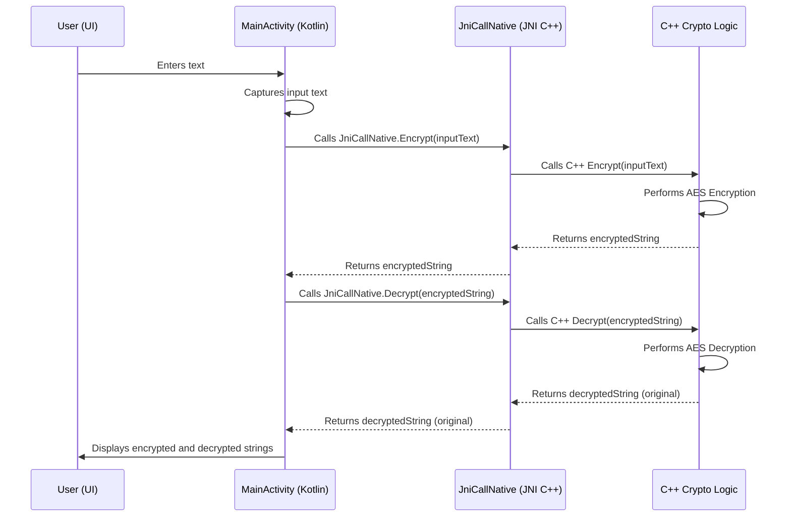

# Android AES Encryption/Decryption Demo

This project is an Android application that demonstrates the principles of AES encryption and decryption. 

## Key Features:

*   **AES Encryption/Decryption:** Implements AES to encrypt and decrypt user-provided text.
*   **C++ Core Logic:** The core cryptographic operations are written in C++ for performance and security, and are accessed from Kotlin using the Java Native Interface (JNI).
*   **Interactive UI:** The application provides a user interface where users can:
    *   Input text.
    *   View the encrypted version of the input text.
    *   View the decrypted version of the encrypted text, verifying the process.

## Purpose:

This application serves as a practical example of:
*   Implementing symmetric encryption on Android.
*   Integrating C++ libraries with an Android (Kotlin) application via JNI.
*   Building a simple UI to interact with cryptographic functions.

## How it Works:

1.  The user enters plaintext into the input field.
2.  Upon triggering encryption, the Kotlin code calls the C++ function via JNI.
3.  The C++ code performs AES encryption on the plaintext.
4.  The encrypted ciphertext is returned to the Kotlin layer and displayed in the UI.
5.  Upon triggering decryption, the ciphertext is sent to the C++ function (again, via JNI).
6.  The C++ code performs AES decryption.
7.  The resulting plaintext is returned and displayed, allowing the user to confirm that it matches the original input.

This project is intended for educational purposes to showcase the integration of JNI for computationally intensive tasks like cryptography within an Android app.

## Installation Requirements:

To build and run this project, you will need the following:

*   **Android SDK:** Version 34 (as specified in `app/build.gradle`).
*   **Android NDK:** Version 26.3.11579264 (as specified in `app/build.gradle`).
*   **Gradle:** Version 8.7 (the project uses Gradle for building; check `gradle/wrapper/gradle-wrapper.properties`).
*   **Android IDE:** An IDE like Android Studio is recommended for ease of development.
*   **C++ Compiler:** A standard C++ compiler that supports C++11 (used for the native JNI components).

## Workflow Diagram

## Use Cases

The AES encryption capabilities demonstrated in this project can be adapted for various real-world scenarios, including but not limited to:

*   **Securing User Credentials:** Encrypting sensitive information like user passwords, API keys, or authentication tokens before storing them locally on a device. This adds a layer of security in case the device's local storage is compromised.
*   **End-to-End Message Encryption:** In chat or messaging applications (peer-to-peer or client-server), messages can be encrypted on the sender's device and decrypted only on the recipient's device, ensuring that the content remains private even from the server administrators.
*   **Protecting Local Data Storage:** Encrypting data stored in local SQLite databases, shared preferences, or configuration files within an application. This is crucial for applications handling sensitive user data, financial information, or proprietary business logic.
*   **Securing Data in Transit:** While HTTPS is standard for securing data transmission, AES encryption can provide an additional application-level security layer. This is particularly useful if data needs to be sent over potentially insecure networks or through intermediaries where end-to-end TLS/SSL might not be guaranteed or is insufficient.
*   **File Encryption:** Protecting the contents of files stored on the device's internal or external storage, ensuring that they are unreadable without the correct decryption key.

While this project serves as a demonstration, the underlying C++ crypto logic can be extended and integrated into more complex systems requiring robust data protection.
